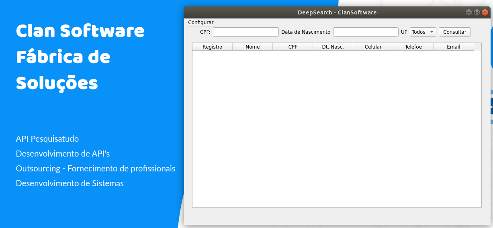

### Como Rodar ###
1. Execute o comando: `pyinstaller --onefile --windowed app.py` para gerar o executavel
2. Acesse a pasta: /dist e execute o arquivo app

## Dependencias ##

`pip install pyqt5`
`apt install python-pyside`
`pip install pyinstaller`

### Instal Conversor .ui in .py on Ubuntu ###

You can use this command's:

`pip3 install --user pyqt5`  -- optional
`sudo apt-get install python3-pyqt5`
`sudo apt-get install pyqt5-dev-tools`
`sudo apt-get install qttools5-dev-tools`

### Convert .ui in .py ###

The pyuic tool works in exactly the same way on all platforms:

C:\>pyuic5 -h
Usage: pyuic5 [options] <ui-file>

Options:
  --version             show program's version number and exit
  -h, --help            show this help message and exit
  -p, --preview         show a preview of the UI instead of generating code
  -o FILE, --output=FILE
                        write generated code to FILE instead of stdout
  -x, --execute         generate extra code to test and display the class
  -d, --debug           show debug output
  -i N, --indent=N      set indent width to N spaces, tab if N is 0 [default: 4]
  -w, --pyqt3-wrapper   generate a PyQt v3 style wrapper

  Code generation options:
    --from-imports      generate imports relative to '.'
    --resource-suffix=SUFFIX
                        append SUFFIX to the basename of resource files
                        [default: _rc]

I suspect the reason "it doesn't work" is that the .ui file you are trying to convert is not in the current directory. So you need to cd to that directory first:

    C:\>cd C:\path\to\my\ui\files

then run pyuic:

    C:\path\to\my\ui\files\>pyuic5 -o ui_form.py form.ui

### Build Executable ###

Code:
`pyinstaller --onefile --windowed <your_init_core_file.py>`

Example:
`pyinstaller --onefile --windowed app.py`